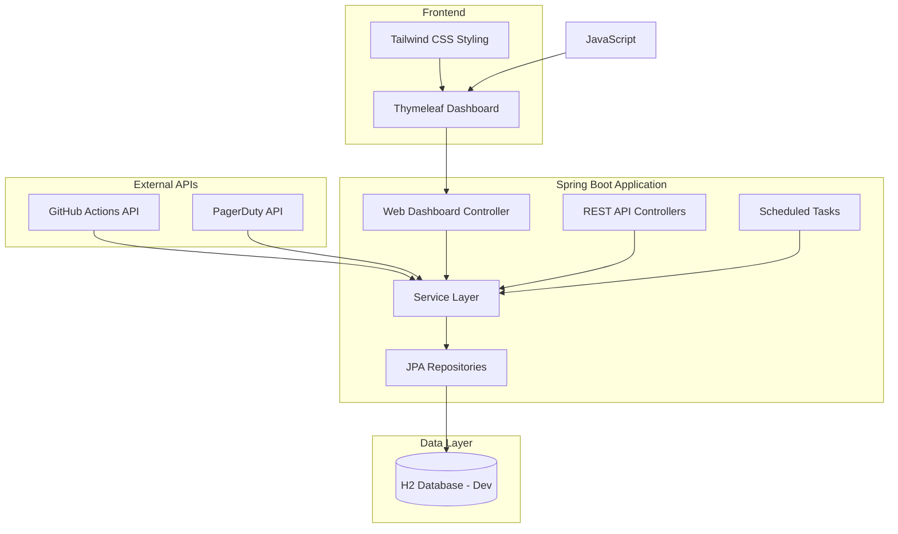

# 📊 Metrics Dashboard

A comprehensive Spring Boot application for calculating and visualizing metrics to measure change failure rate and mean time to recovery in software engineering. This project integrates with **GitHub Actions** for deployment data and **PagerDuty** for incident management, providing a robust dashboard for real-time metrics analysis.


## 🎯 Overview

This application integrates with **GitHub Actions** and **PagerDuty** to automatically collect deployment and incident data, then calculates key metrics:

- **📈 Change Failure Rate (CFR)**: The number of incidents / the number of deployments as percentage
- **⏱️ Mean Time to Recovery (MTTR)**: Average time to resolve production incidents
- **📊 Dashboard Overview**: Comprehensive metrics visualization with time-range filtering

## 🏗️ Architecture Overview

### **System Architecture**



### **Key Components**

1. **External Integrations**
   - GitHub Actions service for deployment data synchronization
   - PagerDuty service for incident data collection
   - Automated data sync with manual trigger options

2. **Core Application**
   - **Controllers**: Web dashboard + REST API endpoints
   - **Services**: Business logic and metrics calculations
   - **Repositories**: Data access layer with JPA/Hibernate
   - **Entities**: Deployment and Incident data models

3. **Frontend Dashboard**
   - Server-side rendering with Thymeleaf
   - Responsive design with Tailwind CSS
   - Interactive time range filtering
   - Real-time sync controls

4. **Data Storage**
   - H2 in-memory database for development

## 🛠️ Architecture Decisions & Trade-offs

### **Technology Choices**

| Component | Technology | Rationale                                                                         | Trade-offs                                                                |
|-----------|------------|-----------------------------------------------------------------------------------|---------------------------------------------------------------------------|
| **Backend Framework** | Spring Boot 3.x | Mature ecosystem, excellent integration support, built-in security                | Heavier footprint vs. lightweight frameworks                              |
| **Database** | H2  | Standard SQL support, Easy development setup,Lightweight design, Fast performance | H2 lacks production features, No persistence when the application is down |
| **ORM** | JPA/Hibernate | Spring Boot integration, database abstraction                                     | Performance overhead vs. raw SQL                                          |
| **Frontend** | Thymeleaf + Tailwind CSS | Server-side rendering, rapid styling, simple deployment                           | Less interactive vs. React/Angular                               |
| **API Documentation** | OpenAPI/Swagger | Industry standard, auto-generation                                                | Additional dependency overhead                                            |

### **Key Assumptions**

1. **Data Sources & Mapping**
   - GitHub Actions workflows represent production deployments
   - PagerDuty incidents represent production failures/outages
   - Workflow conclusion (`success`/`failure`) maps to deployment status
   - Incident resolution time represents service recovery time

2. **Metric Calculations**
   - **CFR** = (Total Incidents / Total Deployments) × 100
   - **MTTR** = Average time from incident creation to resolution
   - **Dashboard** = Aggregated view combining all metrics with time filtering

3. **Data Freshness & Sync**
   - Manual sync provides immediate data refresh
   - GitHub Actions data represents deployment events
   - PagerDuty incidents represent service disruptions
   - Time-range filtering supports trend analysis (7d/30d/90d/custom)

### **Notable Trade-offs & Design Decisions**

#### **✅ Chosen Approach vs ❌ Alternatives**

**Server-Side Rendering vs. Client-Side SPA**
- ✅ Simple deployment, faster initial load, SEO-friendly
- ❌ Could use React/Vue for richer interactions and better UX

**Basic Authentication vs. Advanced Auth**
- ✅ Simple setup for internal tools, adequate security
- ❌ Could implement OAuth2/OIDC for enterprise environments


**H2 Database vs. Full PostgreSQL**
- ✅ Zero-configuration development experience
- ❌ Could use PostgreSQL for production-like testing

**Synchronous API Processing vs. Async**
- ✅ Simple error handling, easier debugging, sufficient performance
- ❌ Could implement async processing for better scalability

## 🚀 Quick Start

### **Prerequisites**

- **Java 17** or higher
- **Maven 3.6+**
- **Thymeleaf**
- **Git**

### **Environment Setup**

1. **Clone the repository:**
   ```bash
   git clone https://github.com/rahuljoshi8/metrics_demo.git
   cd metrics_demo
   ```
### **Since the repository is private, for ease of setup, tokens have been kept as is in the properties file.**

2. **Set up environment variables:**
   ```bash
   export PAGERDUTY_API_TOKEN="your_pagerduty_token"
   export GITHUB_API_TOKEN="your_github_token"
   export GITHUB_REPO_OWNER="your_github_username"
   export GITHUB_REPO_NAME="your_repository_name"
   ```


4. **Run the application:**
   ```bash
   ./mvnw spring-boot:run
   ```

### **Access Points**

- **🖥️ Main Dashboard**: http://localhost:8080/
- **📚 API Documentation**: http://localhost:8080/swagger-ui.html
- **🔍 Database console**: http://localhost:8080/h2-console
- **❤️ Health Check**: http://localhost:8080/actuator/health
- **🔧 External Services Health**: http://localhost:8080/api/v1/health/external-services

### **Dashboard Features**

The main dashboard at `http://localhost:8080/` provides:

- **📊 Metrics Overview**: Change Failure Rate, MTTR, and summary statistics
- **🕐 Time Range Filtering**: 7d/30d/90d presets or custom date ranges
- **🔄 Manual Sync Controls**: Buttons to trigger GitHub Actions and PagerDuty data sync
- **📱 Responsive Design**: Mobile-friendly layout with Tailwind CSS
- **⚡ Real-time Updates**: Loading states and success/error notifications

## 📋 Configuration

### **Required Environment Variables**

```bash
### **Application Properties**

Key configurations in `application.properties`:

# External API Configuration
pagerduty.api.token=${PAGERDUTY_API_TOKEN}
github.api.token=${GITHUB_API_TOKEN}
github.repository.owner=${GITHUB_REPO_OWNER}
github.repository.name=${GITHUB_REPO_NAME}

```

## 🌐 API Usage

### **Key Endpoints**

#### **📊 Dashboard Data**
```bash
curl -v \
  "http://localhost:8080/api/v1/metrics/dashboard?timeRange=7d"
```

#### **📈 Change Failure Rate**
```bash
curl -v \
  "http://localhost:8080/api/v1/metrics/changeFailureRate?startDate=2024-01-01T00:00:00&endDate=2024-01-31T23:59:59"
```

#### **⏱️ Mean Time to Recovery**
```bash
curl -v \
  "http://localhost:8080/api/v1/metrics/mttr?startDate=2024-01-01T00:00:00&endDate=2024-01-31T23:59:59"
```

#### **🔄 Manual Data Synchronization**
```bash
# Sync deployments from GitHub Actions (no response body, check status code)
curl -v -X GET \
  "http://localhost:8080/api/v1/metrics/deployments"

# Sync incidents from PagerDuty (no response body, check status code)
curl -v -X GET \
  "http://localhost:8080/api/v1/metrics/incidents"
```

### **Dashboard Web Interface**

The main dashboard provides a user-friendly interface for:

- **Time Range Selection**: Dropdown with 7d/30d/90d presets or custom date picker
- **One-Click Sync**: Dedicated buttons for GitHub Actions and PagerDuty data refresh
- **Metric Cards**: Visual display of CFR, MTTR, and summary statistics
- **Status Notifications**: Success/error messages for sync operations

### **Response Formats**

**Dashboard Response:**
```json
{
  "changeFailureRate": {
    "changeFailureRatePercentage": 15.5,
    "totalDeployments": 10,
    "totalIncidents": 2,
    "timeRange": "7d",
    "calculatedAt": "2025-06-08T19:41:06"
  },
  "meanTimeToRecovery": {
    "meanTimeToRecoveryMinutes": 120.0,
    "meanTimeToRecoveryHours": 2.0,
    "totalResolvedIncidents": 2,
    "timeRange": "7d"
  },
  "summary": {
    "timeRange": "7d",
    "totalIncidents": 2,
    "totalDeployments": 10,
    "resolvedIncidents": 2
  }
}
```


## Testing


To create new workflows or run existing ones, you can use the following methods:

Method 1: GitHub Web UI (Easiest)


- Go to the repository
- Click the "Actions" tab. You'll see two workflows listed on the left:
   - Release Pipeline
   - Monitoring and Maintenance
- Click on any workflow name
- Click "Run workflow" button (top right)
- Click "Run workflow" again to confirm

Method 2: Push Commits (Automatic)
- Simply push any commit to trigger Release pipelines
- Monitoring and Maintenance workflows run automatically on schedule

To create new incidents, you can use the following method:

- Log onto PagerDuty.com using the provided credentials.
- Create a new incident using the PagerDuty UI for MetricsService.
- The incident can be triggered, acknowledged, and resolved through the PagerDuty interface.


### **Run Tests**
```bash
# All tests
./mvnw test
```


**Test Types:**
- **Unit Tests**: Service layer business logic and calculations

## 📈 Monitoring & Operations

### **Health Monitoring**
- **Application Health**: `/actuator/health` - Overall application status
- **Database Connectivity**: Included in main health endpoint
- **External API Health**: `/api/v1/health/external-services` - GitHub & PagerDuty connectivity
- **JVM Metrics**: `/actuator/metrics` - Memory, CPU, and performance metrics

### **Data Management**
- **Manual Sync**: Use dashboard buttons or API endpoints for immediate data refresh
- **Automatic Scheduling**: Configured for periodic sync
- **Data Persistence**: All metrics data stored in H2
- **Time-Range Queries**: Efficient database indexing for date-range metric calculations


### **Operational Considerations**
- **Deployment**: Single JAR deployment with embedded Tomcat
- **Scaling**: Vertical scaling recommended (CPU/memory)
- **Monitoring**: Built-in Spring Boot Actuator endpoints
- **Logging**: Configurable via Logback with JSON formatting option
- **Security**: Basic authentication with configurable credentials

## 🗄️ Database Schema

### **Automatic Schema Management**
Tables are automatically created from JPA entities using Hibernate DDL:

**H2:**
- In-memory database, recreated on each startup
- Perfect for development and testing
- No external dependencies

### **Core Tables**

**`deployment` Table:**
```sql
CREATE TABLE deployment (
    id BIGSERIAL PRIMARY KEY,
    deployment_id VARCHAR(100) UNIQUE NOT NULL,
    environment VARCHAR(50) NOT NULL,
    status VARCHAR(20) NOT NULL,              -- SUCCESS, FAILURE, IN_PROGRESS
    started_at TIMESTAMP NOT NULL,
    completed_at TIMESTAMP,
    commit_sha VARCHAR(40),
    branch_name VARCHAR(100),
    repository VARCHAR(200),
    triggered_by VARCHAR(100),
    workflow_id VARCHAR(100),
    duration_seconds BIGINT,
    created_at TIMESTAMP DEFAULT CURRENT_TIMESTAMP,
    updated_at TIMESTAMP DEFAULT CURRENT_TIMESTAMP
);
```

**`incident` Table:**
```sql
CREATE TABLE incident (
    id BIGSERIAL PRIMARY KEY,
    incident_id VARCHAR(100) UNIQUE NOT NULL,
    title VARCHAR(500) NOT NULL,
    description TEXT,
    status VARCHAR(20) NOT NULL,              -- TRIGGERED, ACKNOWLEDGED, RESOLVED
    severity VARCHAR(20) NOT NULL,            -- LOW, MEDIUM, HIGH, CRITICAL
    priority VARCHAR(10),
    service VARCHAR(200),
    created_at TIMESTAMP NOT NULL,
    acknowledged_at TIMESTAMP,
    resolved_at TIMESTAMP,
    assigned_to VARCHAR(100),
    escalation_policy VARCHAR(200)
);
```

## 🔧 Development

### **Local Development Setup**

1. **IDE Setup**: Import as Maven project
2. **Database**: Use H2 for local development (default profile)
3. **Hot Reload**: Use Spring Boot DevTools
```

## 📄 License

This project is licensed under the MIT License - see the [LICENSE](LICENSE) file for details.

## 🤝 Support

- **Issues**: [GitHub Issues](https://github.com/rahuljoshi8/metrics_demo/issues)
- **Discussions**: [GitHub Discussions](https://github.com/rahuljoshi8/metrics_demo/discussions)

## 📚 Additional Resources

- [Spring Boot Documentation](https://spring.io/projects/spring-boot)
- [GitHub Actions API](https://docs.github.com/en/rest/actions)
- [PagerDuty API](https://developer.pagerduty.com/api-reference/)
